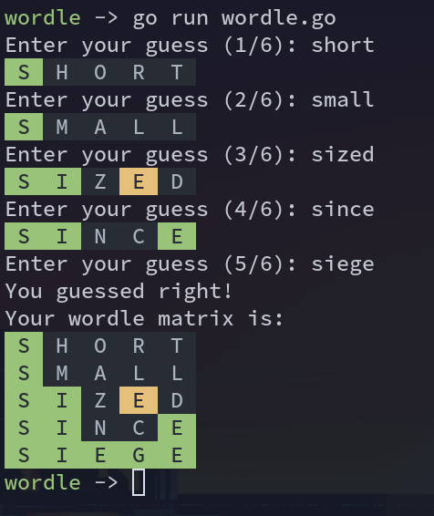

# Wordle

[](https://forthebadge.com)
[](https://forthebadge.com)
[](https://forthebadge.com)

A terminal Wordle written in Go.



## Running

If you couldn't tell from the image, you need Go installed and then run:

```
go run wordle.go
```

## Pros

- Choose your wordlists
- If you're good you can choose longer words
- If you're bad you can increase number of guesses

## Cons

- Sometimes you get weird words with the default wordlist
